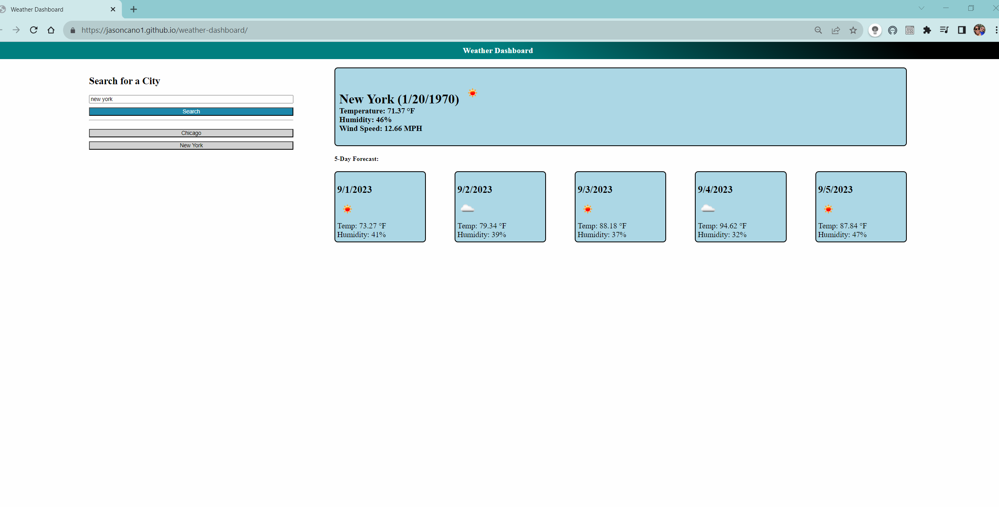

# Weather-Dashboard

## Description
A 5 day forecaster that will also give current weather values for your city search.

## Table of Contents
- [Installation](#installation)
- [Usage](#usage)
- [Credits](#credits)
- [License](#license)
- [Features](#features)
- [Tests](#tests)
- [Contact](#contact)

## Installation
For installation an openweahermap APIKey is required,

## Usage
Current ad forecasted weather over any 

## Credits
Jason Cano

## Features
5 day forecast, saves your search history, 

## Tests
When you search for a city it returns the current and forecasted weather.

## Contact
If there are any questions of concerns, I can be reached at:
[github: jasoncano1](https://github.com/jasoncano1)
##### [email: jasoncano0509@gmail.com] 
##### (mailto:jasoncano0509@gmail.com)
